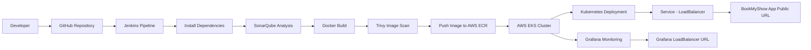
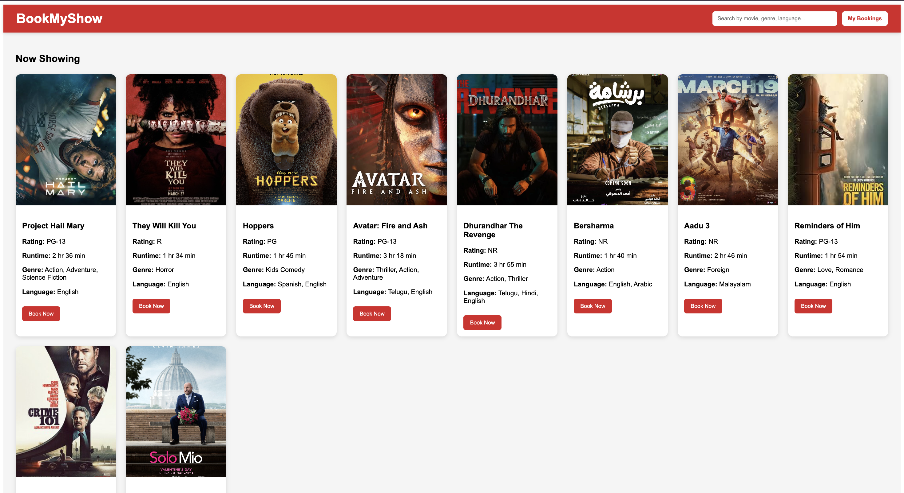
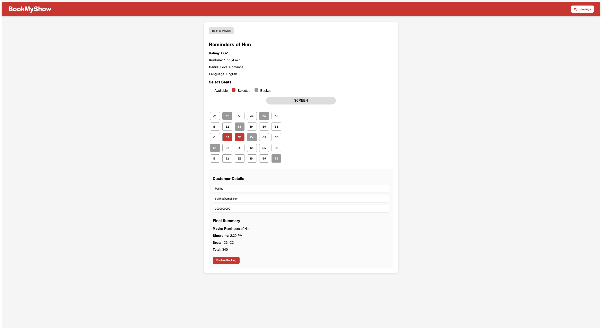
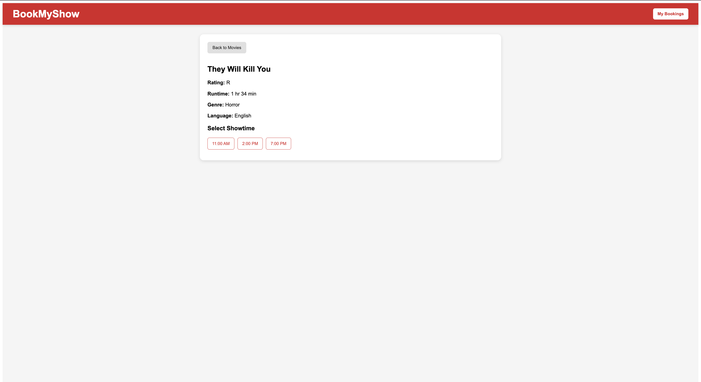
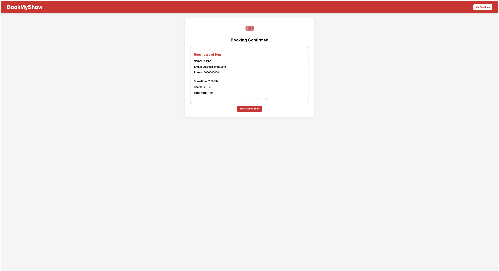

# 🎬 BookMyShow DevOps Project

<p align="center">
  
  
  
  
  
  
  
  
</p>

---

## 📌 Project Overview

This project demonstrates an **end-to-end DevOps implementation** for a BookMyShow-style web application.

The application was built with **React**, containerized using **Docker**, analyzed using **SonarQube**, scanned using **Trivy**, pushed to **AWS ECR**, deployed to **AWS EKS**, and monitored using **Grafana**.

The goal of this project was to build a practical DevOps pipeline covering:

- source control
- CI/CD
- static code analysis
- image security scanning
- container registry
- Kubernetes deployment
- monitoring
---
## 🌐 Application & Tool Access URLs

The following endpoints were used during the project deployment:

---

### 🖥️ Local Development
- **Application (React App):**  
  http://localhost:3000

---

### ☁️ AWS EC2 Deployment
- **Application URL:**  
  http://13.217.50.239:3000  

- **Jenkins Dashboard (CI/CD):**  
  http://13.217.50.239:8080  

- **SonarQube Dashboard (Code Quality):**  
  http://13.217.50.239:9000  

---

### ☸️ Kubernetes (EKS Deployment)
- **Application via LoadBalancer:**  
  http://a0a3cb7b702174a0caefab224ca76e5a-1965170611.us-east-1.elb.amazonaws.com  

---
### 📊 Monitoring (Grafana)

- **Grafana Dashboard:**  
  http://a914d2cd054f94e90b585cf9fff0d15d-1554789301.us-east-1.elb.amazonaws.com

- **Sample Dashboard View:**  
  http://a914d2cd054f94e90b585cf9fff0d15d-1554789301.us-east-1.elb.amazonaws.com/?orgId=1&from=now-6h&to=now&timezone=browser

- Grafana was deployed using Helm and exposed via AWS LoadBalancer  
- Used for visualizing Kubernetes cluster metrics  

#### 🔐 Grafana Access
- **Username:** `admin`  
- **Password:** Retrieved from Kubernetes secret  
  
---

## 🧱 Architecture Diagram


---

## 🏗️ Architecture Components

### 1. Developer
The developer writes code locally and pushes it to GitHub.

### 2. GitHub Repository
Stores application source code, Dockerfile, Jenkinsfile, Kubernetes manifests, and project documentation.

### 3. Jenkins
Acts as the CI/CD engine. It pulls code from GitHub and runs the pipeline.

### 4. SonarQube
Performs static code analysis and reports code-quality issues.

### 5. Docker
Builds the application image.

### 6. Trivy
Scans the Docker image for vulnerabilities.

### 7. AWS ECR
Stores the final Docker image.

### 8. AWS EKS
Runs the application on a Kubernetes cluster.

### 9. Kubernetes Service (LoadBalancer)
Exposes the application publicly.

### 10. Grafana
Provides monitoring dashboard access.

---

## ⚙️ Tech Stack

| Category | Tools / Services |
|----------|----------------|
| Frontend | React |
| Source Control | GitHub |
| CI/CD | Jenkins |
| Code Quality | SonarQube |
| Security Scan | Trivy |
| Containerization | Docker |
| Container Registry | AWS ECR |
| Orchestration | AWS EKS |
| Monitoring | Grafana |
| Cloud Platform | AWS |

---

## 🚀 End-to-End Workflow

### Step 1: Source Code Management
The BookMyShow application source code was pushed to a GitHub repository.

---

### Step 2: Jenkins Pipeline Execution
A Jenkins pipeline was created to automate the following stages:

- Checkout source code from GitHub  
- Install dependencies  
- Run SonarQube analysis  
- Build Docker image  
- Run Trivy image scan  
- Push image to AWS ECR  
- Deploy and run the application  

---

### Step 3: SonarQube Analysis
The React source code was scanned using SonarQube to identify code-quality issues and maintainability concerns.

---

### Step 4: Docker Image Build
The application was containerized with Docker.

- Initially used React dev-server container  
- Later improved to nginx-based production container  

---

### Step 5: Trivy Security Scan
The Docker image was scanned using Trivy to detect vulnerabilities.

This identified base image vulnerabilities, which is expected in real-world DevOps environments.

---

### Step 6: AWS ECR Push
The Docker image was tagged and pushed to a private AWS ECR repository.

---

### Step 7: EKS Cluster Creation
An AWS EKS cluster was created and worker nodes were configured.

---

### Step 8: Kubernetes Deployment
The application was deployed using:

- Kubernetes **Deployment**
- Kubernetes **Service (LoadBalancer)**

---

### Step 9: Application Exposure
AWS automatically provisioned a public LoadBalancer endpoint to access the application.

---

### Step 10: Monitoring
Grafana was deployed and exposed using a LoadBalancer for monitoring access.

---

## 📂 Project Structure

```text
BookMyShow-app/
│
├── public/
├── src/
├── Dockerfile
├── Jenkinsfile
├── package.json
├── package-lock.json
├── deployment.yaml
├── service.yaml
└── README.md
```
---

## 🐳 Docker

### Dockerfile Purpose
The Dockerfile builds the React app and serves it using nginx.

### Build
```bash
docker build -t bookmyshow-app .
docker run -d -p 3000:80 --name bookmyshow-container bookmyshow-app
```
## 🔁 Jenkins Pipeline Stages

1. **Clean Workspace** – Removes previous build artifacts  
2. **Checkout Code** – Pulls source code from GitHub  
3. **Install Dependencies** – Runs `npm install`  
4. **SonarQube Analysis** – Performs static code analysis  
5. **Build Docker Image** – Creates container image  
6. **Trivy Scan** – Scans image for vulnerabilities  
7. **Push Image to ECR** – Uploads image to AWS ECR  
8. **Deploy Application** – Runs or updates container deployment  

## ☸️ Kubernetes Deployment

### Deployment
- Uses Kubernetes **Deployment** to manage application pods  
- Ensures high availability and self-healing  

### Service
- Uses **LoadBalancer Service**  
- Automatically provisions an AWS Elastic Load Balancer  
- Exposes the application to the public internet  

### ⚠️ Note
- AWS free-tier node limits and VPC CNI IP constraints caused pod scheduling issues  
- Deployment was optimized by reducing replicas and resource usage  


## 📊 Monitoring

Grafana was deployed on the Kubernetes cluster to visualize application and system metrics.

### Setup
- Installed using **Helm charts**
- Exposed via **LoadBalancer Service**
- Accessible publicly through AWS ELB

### 🔐 Access Credentials
- **Username:** `admin`
- **Password:** Retrieved from Kubernetes secret:

```bash
kubectl get secret --namespace monitoring grafana \
  -o jsonpath="{.data.admin-password}" | base64 --decode ; echo
```
## ⚠️ Challenges Faced

### 1. Jenkins Configuration Errors
- Jenkins configuration became corrupted during manual changes  
- Required fixing the `config.xml` file and restarting the service  

### 2. SonarQube Availability
- SonarQube container stopped after EC2 restarts  
- Needed manual restart before pipeline execution  

### 3. Docker / Nginx Port Issue
- Application initially failed due to incorrect port mapping  
- Fixed by mapping container port `80` to host port (`3000:80`)  

### 4. EKS Nodegroup Failure
- `t3.medium` instance type could not be used under given constraints  
- Switched to `t3.micro` to proceed with cluster creation  

### 5. CloudFormation Conflicts
- Failed EKS cluster attempts left behind CloudFormation stacks  
- Required manual deletion before recreating the cluster  

### 6. Kubernetes Scheduling Issues
Pods failed to schedule due to:

- **Too many pods** (node-level pod limits)  
- **AWS VPC CNI IP exhaustion**  

This occurred because small EKS nodes have limited pod/IP capacity.

### 7. Monitoring Limitations
- Full **Prometheus + Grafana stack** could not run due to resource constraints  
- Implemented a **Grafana-only setup** as a lightweight monitoring solution  

## ✅ Final Outcome

Successfully implemented the following components:

- GitHub-based source control  
- Jenkins CI/CD pipeline  
- SonarQube code analysis  
- Trivy vulnerability scanning  
- Docker image build and containerization  
- AWS ECR image storage and management  
- AWS EKS cluster deployment  
- Kubernetes LoadBalancer-based application exposure  
- Grafana monitoring setup  

---

## 📘 Key Learnings

This project provided hands-on experience in:

- Designing and implementing CI/CD pipelines  
- Understanding the Docker image lifecycle  
- Performing code quality and security analysis  
- Deploying applications using Kubernetes  
- Working with AWS EKS architecture and services  
- Troubleshooting real-world infrastructure issues (CNI limits, pod scheduling, resource constraints)  

---
## 📸 Application Screenshots

<p align="center">
  
  
</p>

<p align="center">
  
  
</p>
---


